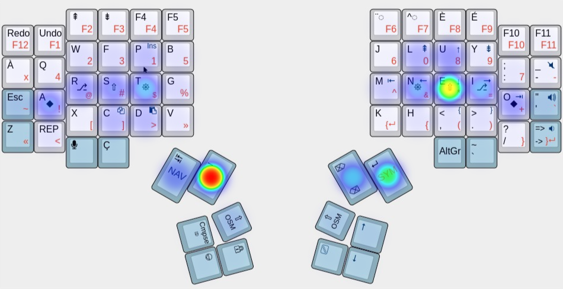

## Precondition's keymap for the Dactyl Manuform 5x6
To be inserted in ~/qmk_firmware/keyboards/handwired/dactyl_manuform/5x6/keymaps/precondition

Figure 1. Heatmap of key presses coming from all layers. Unlike the ASCII art inside keymap.c, this figure is not automatically generated and may thus go out of date.

This keymap uses Colemak-DH for its alpha base with the addition of common French accented keys in direct access and dead keys for the less common ones. For use in English, French, and programming.

Notably, [home row mods](https://precondition.github.io/home-row-mods) are used, as well as tap dance and combos.

Aside from the usual combos that expand to a single special character or command like <kbd>\\</kbd> or <kbd>Caps Word</kbd>, you can find, what I've dubbed, “steno-lite” combos in `combos.c`. Taking inspiration from machine stenography, common n-grams, word parts and words that are too short to abbreviate (in a text expansion program such as AutoKey) are assigned a key chord/combo, most frequently involving the <kbd>Backspace</kbd> key. Using <kbd>Backspace</kbd>+<kbd>Letter(s)</kbd> has the benefit of greatly reducing potential combo misfires as you're unlikely to type a letter and simultaneously delete it.

Keymap visualisation diagrams are automatically generated with the help of [keymapviz] every time I compile.

[keymapviz]: https://github.com/yskoht/keymapviz

### Keymap Tricks
This keymap contains many nifty QMK tricks that can inspire you for your own keymap. Here's a non-exhaustive list.

1. Home row mods: All the modifiers on the home row.
2. `TD_DOT`: Double tap the dot key to produce <kbd>.</kbd><kbd>space</kbd><kbd>One-Shot Shift</kbd> to quickly flow from one sentence to another.
3. One-Shot Swap Hand: For one-handed typing.
4. `CAPS_WORD`: Capitalizes the next word you type and then automatically toggle off Caps Lock. Perfect for typing all-caps IDENTIFIERS in code.
5. `REPEAT`: Repeat the last (modified) keystroke. This is used to eliminate the same-finger use that stems from double-tapping the same key. Ideally, this should be a thumb key but I couldn't fit it in my cluster in a satisfying manner.

### OS Setup

* OS: Xubuntu Linux
* Regional keyboard layout: Modified English US intl. with AltGr dead keys
    * Swapped the shift pairs of the semicolon key

### Required features
New features take a very long time to get merged into `qmk:master` so, meanwhile, I merge pending pull requests into my own fork to use them. Below is the list of PRs that are required for this particular instance of my keymap to work properly — It varies from branch to branch.

- N/A
